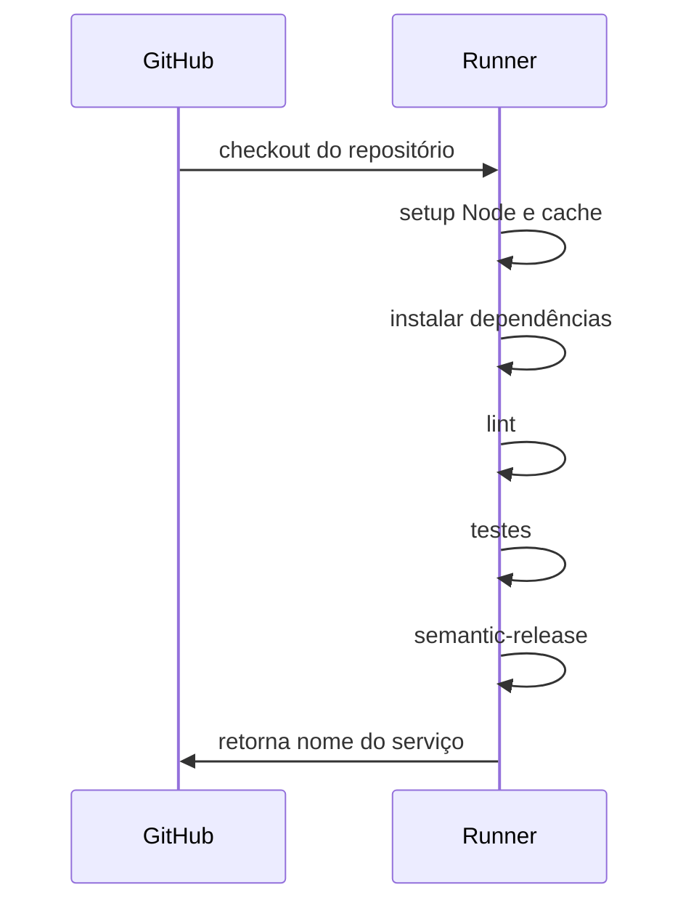
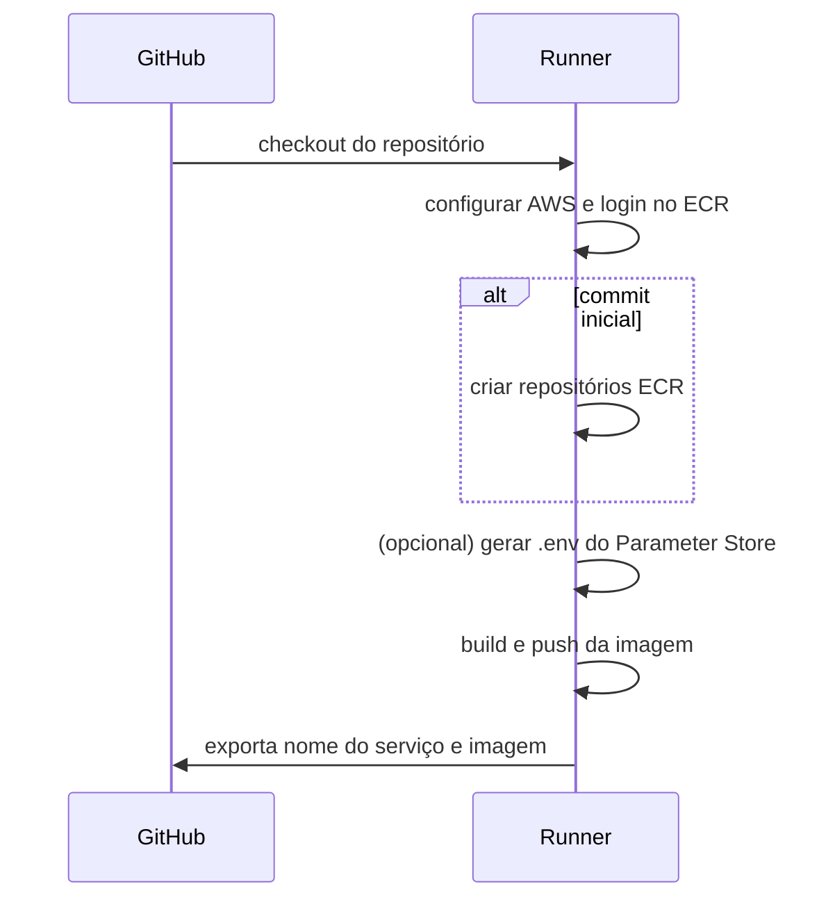
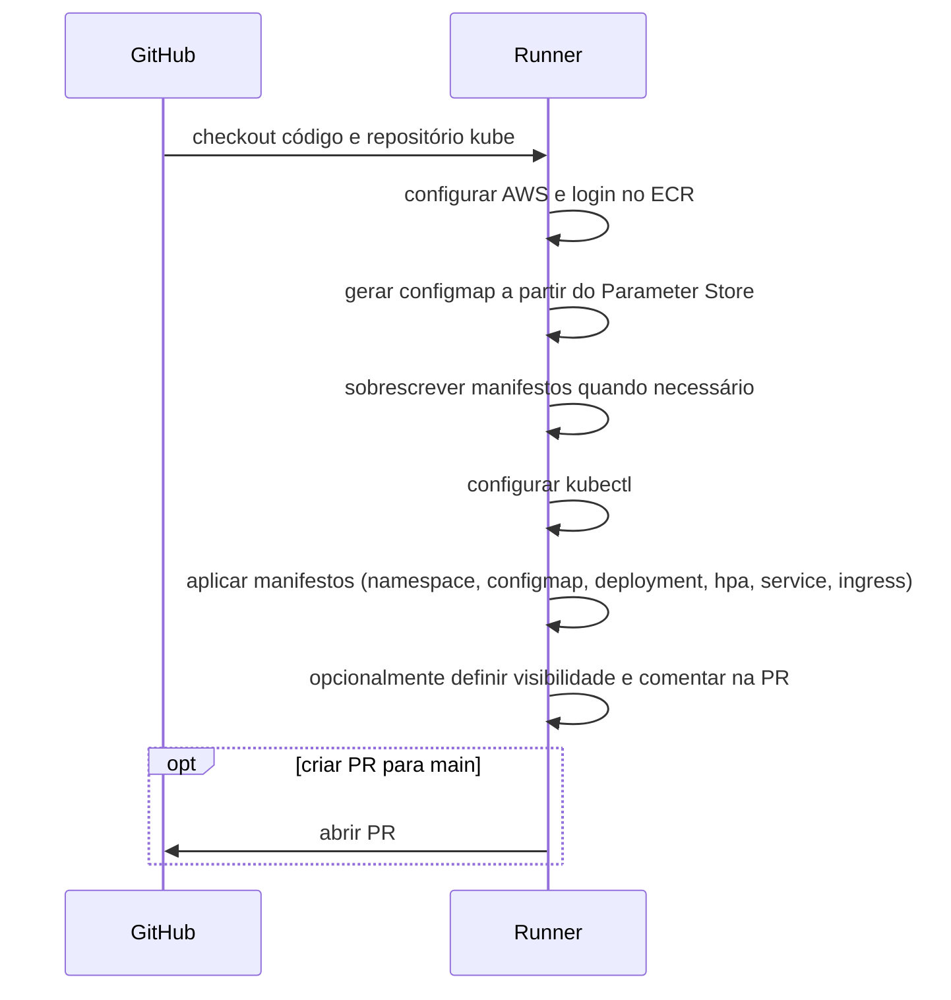
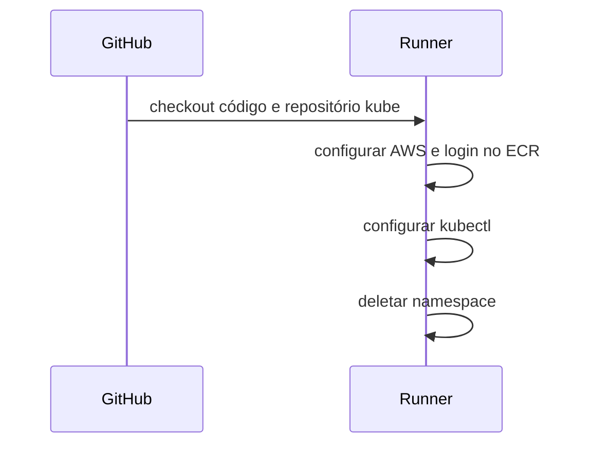

# CI

Este repositório contém workflows do **GitHub Actions** usados para construir aplicações Node, publicar imagens no Amazon ECR e realizar implantações em clusters Kubernetes. Também há um fluxo destinado à remoção de aplicações em ambientes de revisão.

## Visão geral dos fluxos

- **CI-BASE** (`base_node_build.yml`): fluxo de construção de projetos Node. Executa instalação de dependências, lint, testes e publica uma versão através do [semantic-release](https://github.com/semantic-release/semantic-release).
- **CI-ECR-BASE** (`base_build_push_ecr.yml`): prepara o repositório ECR, gera o arquivo `.env` opcionalmente, constrói a imagem Docker e faz push para o ECR.
- **CI-K8-BASE** (`ci_k8_base.yml`): realiza o deploy de imagens no Kubernetes utilizando arquivos padronizados presentes neste repositório.
- **CI-K8-BASE-UNDEPLOY** (`ci_k8_undeploy_base.yml`): remove um deploy previamente criado para ambientes de revisão.
- **CI-LOCAL** (`ci_local.yml`): fluxo simplificado utilizado apenas para executar o `semantic-release` localmente.

Os arquivos ficam em `.github/workflows/` e são reutilizáveis via `workflow_call` em outros repositórios.

## Diagramas de sequência

### CI-BASE


### CI-ECR-BASE


### CI-K8-BASE


### CI-K8-BASE-UNDEPLOY


## Política do ECR

Apolítica `ecr_policy.json` define uma regra de lifecycle para manter apenas as duas últimas imagens em cada repositório do ECR:

```json
{
    "rules": [
      {
        "rulePriority": 1,
        "description": "Expire count images more then 2 ",
        "selection": {
          "tagStatus": "any",
          "countType": "imageCountMoreThan",
          "countNumber": 2
        },
        "action": {
          "type": "expire"
        }
      }
    ]
}
```

## Execução local

O workflow `ci_local.yml` é utilizado apenas para disparar o `semantic-release` quando um push é realizado na branch `main`.

