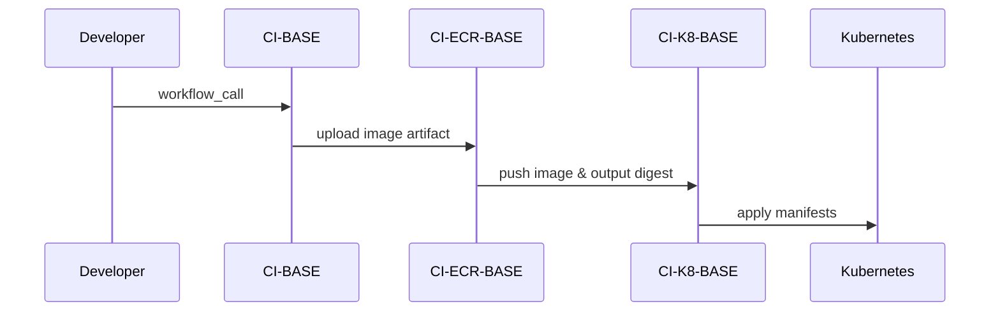
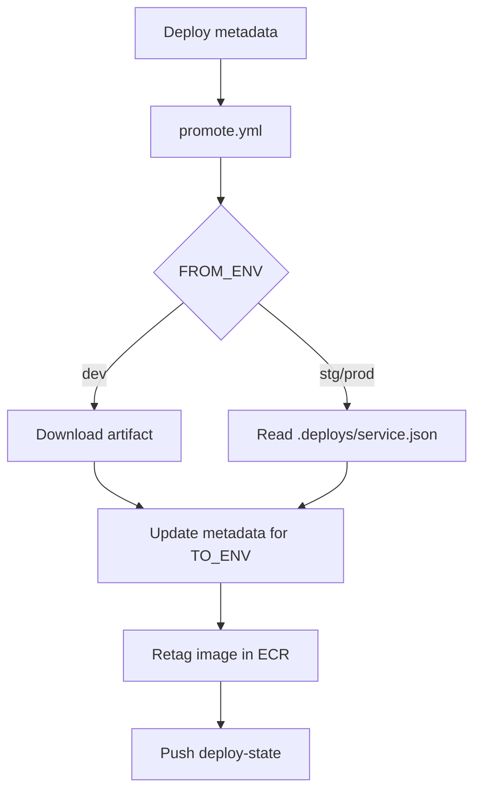

# ci

This repository contains example GitHub Actions workflows that build, publish and deploy Node.js services. Each workflow is designed to be re-used via `workflow_call` in other projects.

## Workflows

### CI-BASE (`.github/workflows/base_node_build.yml`)
This workflow prepares the Node.js project, runs tests and builds a Docker image.
- Sets up the Node environment and caches dependencies
- Runs lint and tests (optionally publishing coverage)
- Publishes a release using semantic-release
- Builds a Docker image and uploads it as an artifact
- Outputs the service name so other workflows can use it

### CI-ECR-BASE (`.github/workflows/base_build_push_ecr.yml`)
Loads the Docker image artifact produced by `CI-BASE` and pushes it to Amazon ECR.
- Configures AWS credentials and logs in to ECR
- Tags the image with the commit SHA and environment
- Optionally tags the pull request number
- Outputs the service name and image digest

### CI-K8-BASE (`.github/workflows/ci_k8_base.yml`)
Deploys the previously built image to Kubernetes.
- Checks out the `kube` manifests repository
- Loads environment variables from AWS SSM
- Renders manifests with `envsubst` and applies them with `kubectl`
- Manages deployment metadata in `.deploys/service.json`
- Optionally comments on the pull request with the deployed image

### CI-K8-BASE-UNDEPLOY (`.github/workflows/ci_k8_undeploy_base.yml`)
Removes preview environments created for pull requests by deleting the Kubernetes namespace.

### promote.yml
Promotes an image from one environment to another.
- Reads deployment metadata from `.deploys/service.json` or a dev artifact
- Updates the target environment entry and retags the image in ECR
- Pushes the updated metadata back to the `deploy-state` branch

### CI-LOCAL (`.github/workflows/ci_local.yml`)
Runs semantic-release on the `main` branch. It is mainly used locally to generate releases.

## Sequence overview

## Promote flow

The `ci_local.yml` workflow is used only for running semantic-release locally.
