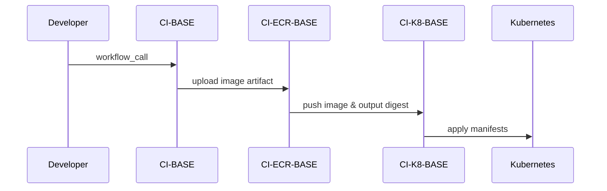
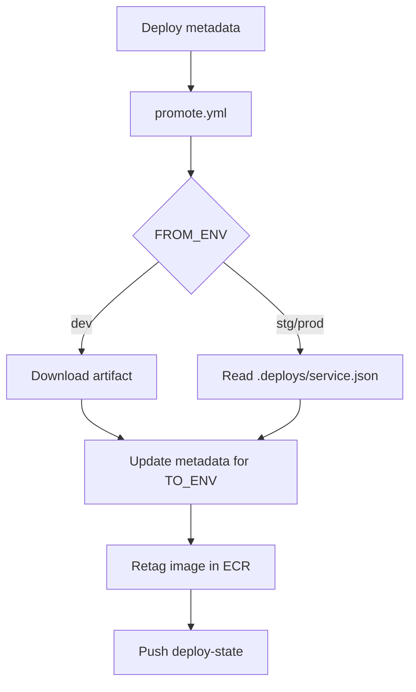

# ci

This repository contains example GitHub Actions workflows that build, publish and deploy Node.js services. Each workflow is designed to be re-used via `workflow_call` in other projects.

## Workflows

### CI-BASE (`.github/workflows/base_node_build.yml`)
This workflow prepares the Node.js project, runs tests and builds a Docker image.
- Sets up the Node environment and caches dependencies
- Runs lint and tests (optionally publishing coverage)
- Publishes a release using semantic-release
- Builds a Docker image and uploads it as an artifact
- Outputs the service name so other workflows can use it
- Validates the workers declared in `.quero/workers/`, when the service has any (see below)

### CI-ECR-BASE (`.github/workflows/base_build_push_ecr.yml`)
Loads the Docker image artifact produced by `CI-BASE` and pushes it to Amazon ECR.
- Configures AWS credentials and logs in to ECR
- Tags the image with the commit SHA and environment
- Optionally tags the pull request number
- Outputs the service name and image digest

### CI-K8-BASE (`.github/workflows/ci_k8_base.yml`)
Deploys the previously built image to Kubernetes.
- Checks out the `kube` manifests repository
- Loads environment variables from AWS SSM
- Renders manifests with `envsubst` and applies them with `kubectl`
- Manages deployment metadata in `.deploys/service.json`
- Optionally comments on the pull request with the deployed image

### CI-K8-BASE-UNDEPLOY (`.github/workflows/ci_k8_undeploy_base.yml`)
Removes preview environments created for pull requests by deleting the Kubernetes namespace.

### promote.yml
Promotes an image from one environment to another.
- Reads deployment metadata from `.deploys/service.json` or a dev artifact
- Updates the target environment entry and retags the image in ECR
- Pushes the updated metadata back to the `deploy-state` branch

### CI-WORKERS-DEPLOY (`.github/workflows/ci_workers_deploy.yml`)
Deploys the workers a service declares in `.quero/workers/`, one job per worker, derived from the declaration — adding a worker adds no workflow line to any service.

It does **not** call `CI-PUSH_GITOPS`, which derives both the definitions folder and the SSM path from the service name — a worker needs them to differ. Worker sizing (cpu, memory, probes, replicas) stays in `kube-apps-definitions`, owned by DevOps.

> **Open point.** The stg ApplicationSet sets `destination.namespace: '{{path.basename}}'`, so `<service>-worker-<name>` lands in a namespace of its own and does not see the service's ConfigMap. This workflow only writes `version-values.yaml`; something still has to create `<service>-worker-<name>-env-cm` from the service's SSM path before the first deploy.

The matrix is serial on purpose: the jobs commit to the same definitions repo, and concurrent pushes turn into rebase conflicts.

### CI-WORKERS-LIST (`.github/workflows/ci_workers_list.yml`)
Emits the list of workers declared in `.quero/workers/` of the calling repository. For callers that do not go through `CI-BASE` — the push to `main` deploys from `promote.yml`, which does not carry that list.

### CI-LOCAL (`.github/workflows/ci_local.yml`)
Runs semantic-release on the `main` branch. It is mainly used locally to generate releases.

## Workers convention (`.quero/workers/`)

A service declares each worker in one file, `.quero/workers/<name>.yaml`:

```yaml
name: consumers
description: Consumes the catalog Kafka topics
owner: team-merchant
entrypoint: dist/src/worker.js
```

The deployed command is derived from it as `node <entrypoint> <name>`, and the app in `kube-apps-definitions` is `<service>-worker-<name>`.

**Adopting the convention is creating the file.** `CI-BASE` detects the directory and skips every worker job when it is absent, so a service with no worker pays nothing.

The only wiring a service adds is the deploy call, once per environment, next to the api deploy:

```yaml
  deploy-workers-stg:
    needs: publish-ecr-stage
    uses: QueroDelivery/ci/.github/workflows/ci_workers_deploy.yml@v5.7.1
    with:
      WF_SERVICE_NAME: ${{ needs.publish-ecr-stage.outputs.servicename }}
      WF_ENV_TYPE_DEPLOY: staging
      WF_IMAGE_TAG: ${{ needs.publish-ecr-stage.outputs.version_tag }}
    secrets:
      WF_GITHUB_TOKEN: ${{ secrets.GH_TOKEN_CI }}
```

`CI-WORKERS-DEPLOY` reads `.quero/workers/` from the calling repository, so the list is never repeated in the service — a worker added or removed changes one file. `WF_WORKERS` remains for a caller that already holds the list, such as the `workers` output of `CI-BASE`, and skips the extra checkout.

Three things are checked, in this order:

1. **The declaration, before `yarn release`.** Schema, `name` matching the filename, a single entrypoint across the service, and an existing `src/workers/<name>.worker.ts`. Cheap and fails fast — it runs before the release precisely because the authoritative check cannot.
2. **The declaration against the built image** (`validate-workers`). Runs `<entrypoint> --list` inside the image that is about to ship and compares the set of workers it accepts with the declared one. This is the authoritative check, and it can only run after `docker build` — which happens after `yarn release`. Hence the split.
3. **The declaration against `kube-apps-definitions`** (`validate-workers-defs`). Read-only: DevOps keeps the pen. A declared worker with no folder never deploys; a folder with no declaration means a pod running a name the entrypoint does not know, which is `CrashLoopBackOff` forever. Blocking on push, warning on pull request, because `defs/main` is a moving target and a developer's PR should not go red over someone else's pending change.

The `--list` contract lives in `@querodelivery/qd-packages` (`WorkerBootstrap`): it prints the registry as JSON and exits before touching Mongo, Redis or the broker, so it answers with no environment configured.

## Sequence overview


```mermaid
sequenceDiagram
    participant Dev as Developer
    participant CI_BASE as CI-BASE
    participant CI_ECR as CI-ECR-BASE
    participant Deploy as CI-K8-BASE
    Dev->>CI_BASE: workflow_call
    CI_BASE->>CI_ECR: upload image artifact
    CI_ECR->>Deploy: push image & output digest
    Deploy->>Kubernetes: apply manifests
```

## Promote flow


```mermaid
flowchart TD
    A[Deploy metadata] --> B[promote.yml]
    B --> C{FROM_ENV}
    C -->|dev| D[Download artifact]
    C -->|stg/prod| E[Read .deploys/service.json]
    D --> F[Update metadata for TO_ENV]
    E --> F
    F --> G[Retag image in ECR]
    G --> H[Push deploy-state]
```
The `ci_local.yml` workflow is used only for running semantic-release locally
