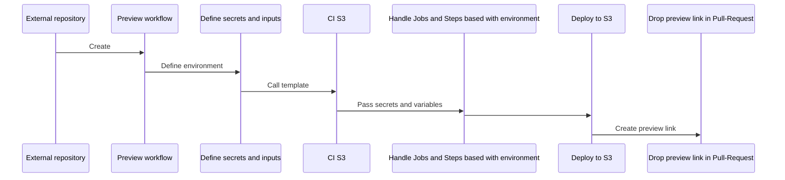
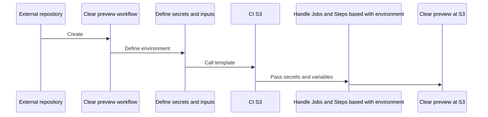
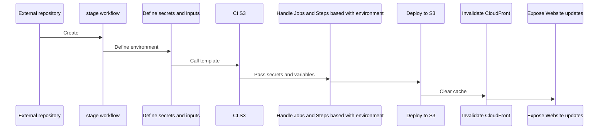
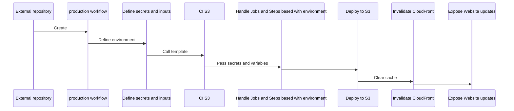

# 🚀 CI Template: Deploy to S3 + CloudFront
## ci-s3-deploy-multi-environment.yml

This CI pipeline streamlines the **building and deployment of static applications** to an **S3 bucket**, coupled with **automatic CloudFront cache invalidation**.

-----

## ✅ Features

  * **App Build Process**: Automates the build of your static application.
  * **S3 Upload with Cache-Control**: Efficiently uploads your built application to S3 with optimized cache control settings.
  * **Automatic CloudFront Invalidation**: Ensures immediate content updates by invalidating CloudFront cache after deployment.
  * **Multi-environment Support**: Configurable for different deployment environments (e.g., Stage, Production).

-----

## ⚙️ How to Use

### Project Configuration

To ensure dynamic routing and seamless integration, configure your frontend project (e.g., with Vite + React) as follows:

  * **React Router DOM**: When using `react-router-dom` with `createBrowserRouter`, set the `basename` using the environment variable `import.meta.env.VITE_BROWSER_ROUTER_BASENAME`. This variable will be exposed during the CI build process.
  * **Vite Configuration**: In your `vite.config.ts`, define the `base` property like this:
    ```typescript
    base: process.env.VITE_BROWSER_ROUTER_BASENAME || '/',
    ```

### 🌐 `BASENAME` Configuration for Multiple Frameworks

During the CI build process, the value of the `PREVIEW_PREFIX` environment variable is used to define the **basename** (or base path) of the application — i.e., the subdirectory where the app will be served (e.g., `/preview-123/`).

The following environment variables are exported and customized for each supported framework to ensure proper routing behavior when deployed under a subpath:

```bash
export VITE_BROWSER_ROUTER_BASENAME="/${{ env.PREVIEW_PREFIX }}"
export PUBLIC_URL="/${{ env.PREVIEW_PREFIX }}"
export NEXT_PUBLIC_BASENAME="/${{ env.PREVIEW_PREFIX }}"
export NG_APP_BASENAME="/${{ env.PREVIEW_PREFIX }}/"
export VUE_APP_BASENAME="/${{ env.PREVIEW_PREFIX }}"
````

#### 🔹 Vite

* **Variable:** `VITE_BROWSER_ROUTER_BASENAME`
* **Usage:** Passed to `<BrowserRouter basename={...}>` and "base" property in vite.config
* **Accessed via:** `import.meta.env.VITE_BROWSER_ROUTER_BASENAME`

#### 🔹 React (Create React App)

* **Variable:** `PUBLIC_URL`
* **Usage:** Passed to `<BrowserRouter basename={...}>`
* **Accessed via:** `process.env.PUBLIC_URL`

#### 🔹 Next.js

* **Variable:** `NEXT_PUBLIC_BASENAME`
* **Usage:** Used for custom route handling or asset paths
* **Accessed via:** `process.env.NEXT_PUBLIC_BASENAME`

#### 🔹 Angular

* **Variable:** `NG_APP_BASENAME`
* **Usage:** Used as `APP_BASE_HREF` or passed to `--base-href` during build
* **Accessed via:** Depends on strategy (recommends `@ngx-env/builder`)

#### 🔹 Vue.js (Vue CLI)

* **Variable:** `VUE_APP_BASENAME`
* **Usage:** Used to configure `publicPath` in `vue.config.js`
* **Accessed via:** `process.env.VUE_APP_BASENAME`

### 🛠️ Note

Each variable follows the environment conventions of its respective framework and should be used during build time or app initialization. This ensures the application works correctly when deployed under a subdirectory (`/${PREVIEW_PREFIX}/`).

### 📌 Why set the basename?

When deploying a Single Page Application (SPA) using Static Site Generation (SSG) — such as with **Vite** — to environments like Amazon S3, you often serve your site under a **subpath** (e.g., `https://example.com/my-app/`) instead of the root (`/`).

By setting the `basename` in your **router** and the `base` in your **Vite config**, you ensure:

#### ✅ Correct routing
React Router knows that all routes should be resolved relative to the subpath.

#### ✅ Correct asset loading
JS, CSS, and other static assets will be linked using the correct base path (e.g., `/my-app/assets/...`) in the generated `index.html`.

#### ⚠️ Without this configuration
The app may break when accessed from a subdirectory:

- Routes may return **404**
- Static assets may **fail to load**

#### 🔁 Always match the deployed subpath
Avoid broken links and routing issues by ensuring the subpath used in your configuration matches the one used during deployment — **regardless of the framework or setup** you're using.

## GitHub Actions Workflow Files

To set up the CI/CD pipeline, you need to create a `.github/workflows` folder in the root of your repository. Inside this folder, add the following workflow files:

### clear_s3_preview_subpath.yml

```
name: Clear deployed preview in S3

on:
  pull_request:
    types: [closed]

jobs:
  clear_s3_preview:
    if: |
      github.event.pull_request.head.ref != 'main' &&
      github.event.pull_request.head.ref != 'stage'
    uses: QueroDelivery/ci/.github/workflows/ci_s3_clear_preview.yml@main
    secrets:
      AWS_ACCESS_KEY_ID: ${{ secrets.AWS_ACCESS_KEY_ID }}
      AWS_SECRET_ACCESS_KEY: ${{ secrets.AWS_SECRET_ACCESS_KEY }}
      AWS_REGION: ${{ secrets.AWS_REGION }}
      S3_BUCKET_NAME: ${{ secrets.S3_BUCKET_NAME }}
```

***

### upload_build_preview_to_s3.yml

```
name: Deploy build preview in S3

on:
  pull_request:
    types: [opened, synchronize, reopened]
  workflow_call: {}

jobs:
  deploy_build_preview_in_s3:
    if: |
        github.event.pull_request.head.ref != 'main' &&
        github.event.pull_request.head.ref != 'stage'
    uses: QueroDelivery/ci/.github/workflows/ci_s3_deploy_multi_environment.yml@main
    with:
      project_build_envs: ${{ vars.PROJECT_BUILD_ENVS }}
      environment_type: preview
    secrets:
      AWS_ACCESS_KEY_ID: ${{ secrets.AWS_ACCESS_KEY_ID }}
      AWS_SECRET_ACCESS_KEY: ${{ secrets.AWS_SECRET_ACCESS_KEY }}
      AWS_REGION: ${{ secrets.AWS_REGION }}
      S3_BUCKET_NAME: ${{ secrets.S3_BUCKET_NAME }}
      CLOUDFRONT_DISTRIBUTION_ID: ${{ secrets.CLOUDFRONT_DISTRIBUTION_ID }}
      WF_GITHUB_TOKEN: ${{ secrets.WF_GITHUB_TOKEN }}
```

***

### upload_prod_build_to_s3.yml

```
name: Deploy build production in S3

on:
  push:
    branches:
      - main
  workflow_call: {}

jobs:
  deploy_build_production_in_s3:
    uses: QueroDelivery/ci/.github/workflows/ci_s3_deploy_multi_environment.yml@main
    with:
      has_semantic_release: true
      project_build_envs: ${{ vars.PROJECT_BUILD_ENVS }}
      environment_type: prod
    secrets:
      AWS_ACCESS_KEY_ID: ${{ secrets.AWS_ACCESS_KEY_ID }}
      AWS_SECRET_ACCESS_KEY: ${{ secrets.AWS_SECRET_ACCESS_KEY }}
      AWS_REGION: ${{ secrets.AWS_REGION }}
      S3_BUCKET_NAME: ${{ secrets.S3_BUCKET_NAME }}
      CLOUDFRONT_DISTRIBUTION_ID: ${{ secrets.CLOUDFRONT_DISTRIBUTION_ID }}
      WF_GITHUB_TOKEN: ${{ secrets.WF_GITHUB_TOKEN }}
```

***

### upload_stage_build_to_s3.yml

```
name: Deploy build stage in S3

on:
  push:
    branches:
      - stage
  workflow_call: {}

jobs:
  deploy_build_stage_in_s3:
    uses: QueroDelivery/ci/.github/workflows/ci_s3_deploy_multi_environment.yml@main
    with:
      has_semantic_release: false
      project_build_envs: ${{ vars.PROJECT_BUILD_ENVS }}
      environment_type: stage
    secrets:
      AWS_ACCESS_KEY_ID: ${{ secrets.AWS_ACCESS_KEY_ID }}
      AWS_SECRET_ACCESS_KEY: ${{ secrets.AWS_SECRET_ACCESS_KEY }}
      AWS_REGION: ${{ secrets.AWS_REGION }}
      S3_BUCKET_NAME: ${{ secrets.S3_BUCKET_NAME }}
      CLOUDFRONT_DISTRIBUTION_ID: ${{ secrets.CLOUDFRONT_DISTRIBUTION_ID }}
      WF_GITHUB_TOKEN: ${{ secrets.WF_GITHUB_TOKEN }}
```

***

## GitHub Actions `Secrets`

For the CI pipeline to function correctly, you must add the following **secrets** to your repository's "Actions" settings to each `environment`:

- Should create `stage` and `prod` environments in GitHub repository -> Settings -> Secrets and variables -> Actions -> Manage environment secrets.

#### Stage Secrets

Secrets for your `stage` environment:

  * `AWS_ACCESS_KEY_ID`: Your AWS IAM access key ID.
  * `AWS_SECRET_ACCESS_KEY`: Your AWS IAM secret access key.
  * `AWS_REGION`: The AWS region where your S3 bucket is located.
  * `S3_BUCKET_NAME`: The name of your S3 bucket for the stage environment.
  * `CLOUDFRONT_DISTRIBUTION_ID`: The CloudFront distribution ID for the stage environment.
  * `WF_GITHUB_TOKEN`: A GitHub classic token with `repo` permissions, used for workflow operations.

#### Production Secrets

Secrets for your `prod` environment:

  * `AWS_ACCESS_KEY_ID`: Your AWS IAM access key ID.
  * `AWS_SECRET_ACCESS_KEY`: Your AWS IAM secret access key.
  * `AWS_REGION`: The AWS region where your S3 bucket is located.
  * `S3_BUCKET_NAME`: The name of your S3 bucket for the production environment.
  * `CLOUDFRONT_DISTRIBUTION_ID`: The CloudFront distribution ID for the production environment.
  * `WF_GITHUB_TOKEN`: A GitHub classic token with `repo` permissions, used for workflow operations.

## GitHub Actions `Variables`

For the CI pipeline to function correctly, you must add the following **variables** to your repository's "Actions" settings to each `environment`:

- Should create `stage` and `prod` environments in GitHub repository -> Settings -> Secrets and variables -> Actions -> Manage environment variables.

#### Stage Variables

Variables for your `stage` environment:

  * `PROJECT_BUILD_ENVS`: Your FRONT-END project envs of `stage` environment.

#### Production Variables

Variables for your `prod` environment:

  * `PROJECT_BUILD_ENVS`: Your FRONT-END project envs of `prod` environment.

## CI inputs

- `has_semantic_release`: Enables or disables the release creation.
- `project_build_envs`: Receive envs of builded Front-end project.
- `environment_type`: Define environment, `stage`, `prod`, `preview` or `clear_preview`.

## All available flows

### Deploy S3 preview



### Clear S3 preview



### Deploy stage



### Deploy production

